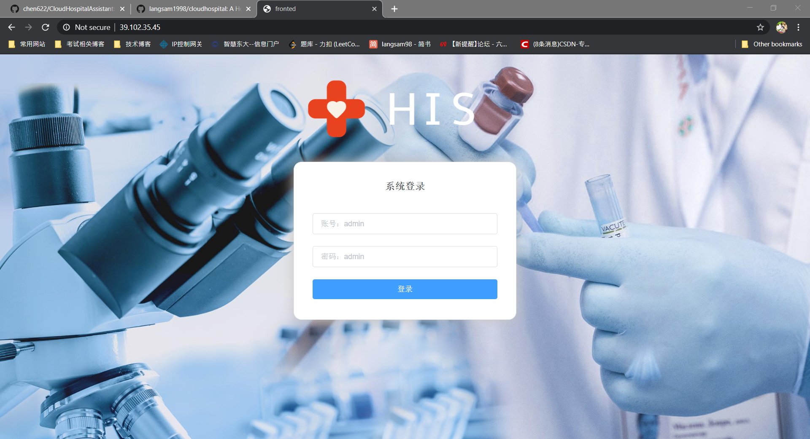
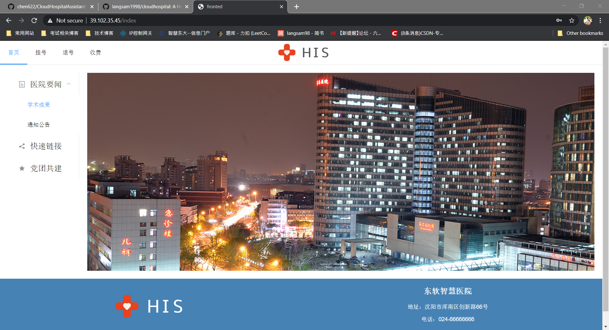

# Cloud Hospital Assistant

[访问地址]: http://39.102.35.45/	"数据库部分丢失"

## 开发环境

- 使用 Intellij IDEA 2019.3.2 版本作为继承开发环境
- 使用 Java 1.8 版本作为编译器
- 使用 Maven 3.6.1 版本作为项目构建工具
- 使用 Mysql 8.0.15 版本作为数据库
- 使用 Node.js 12.16.0 版本作为前端运行环境

界面和部分代码参考：https://github.com/chen622/CloudHospitalAssistant

